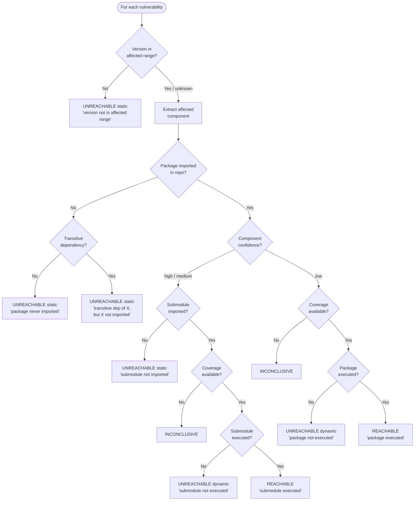

# Verdict Engine

The verdict engine (`ca9.engine`) is the core of ca9. It implements a 4-state decision tree that assigns a verdict to each vulnerability.

## Decision tree



## The four verdicts

| Verdict | Meaning | Action |
|---|---|---|
| **REACHABLE** | Evidence shows the vulnerable package, affected component, or known vulnerable API is reachable | Fix this CVE |
| **UNREACHABLE (static)** | Vulnerable code is never imported | Safe to ignore |
| **UNREACHABLE (dynamic)** | Code is imported but never executed in tests | Likely safe; monitor |
| **INCONCLUSIVE** | Cannot determine without more data | Provide coverage data |

## Entry point

```python
from ca9.engine import analyze
from ca9.models import Vulnerability, Report

report: Report = analyze(
    vulnerabilities=vulnerabilities,
    repo_path=Path("."),
    coverage_path=Path("coverage.json"),  # optional
)
```

The diagram shows the base package/submodule flow. Curated vulnerable API rules can also mark a finding reachable when first-party code calls a known affected API, and proof standards can downgrade weak suppressions to `INCONCLUSIVE`.

The `analyze()` function:

1. Collects all imports from the repository (via `ast_scanner`)
2. Resolves transitive dependencies
3. Loads coverage data (if provided)
4. For each vulnerability, extracts the affected component and walks the decision tree
5. Returns a `Report` with all `VerdictResult` objects

## Reasoning trace

Every `VerdictResult` includes a `reason` string explaining *why* that verdict was assigned. Use `--verbose` in the CLI to see these traces:

```
GHSA-abcd-1234 │ jinja2 │ UNREACHABLE (static)
  → jinja2.sandbox not imported in repo (matched via submodule analysis, confidence: high)
```
