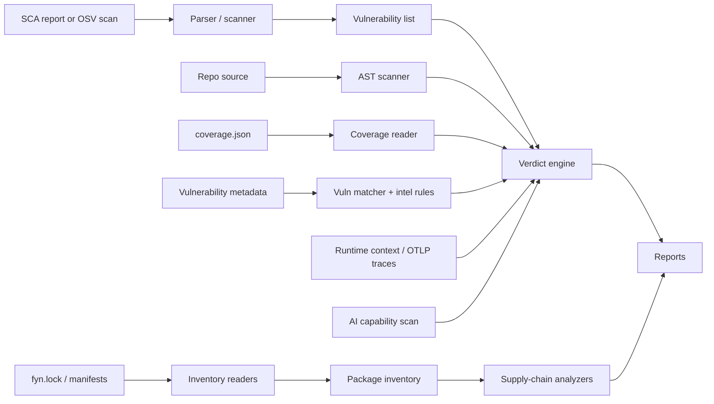

# Architecture Overview

ca9 is designed as a layered pipeline: **ingest -> analyze -> decide -> report**.

## High-level flow



## Module map

```
src/ca9/
├── advisory.py               # Advisory aliases, CWE/CPE extraction, purl helpers, cache freshness
├── models.py                 # Dataclasses: Vulnerability, Evidence, Verdict, Report
├── engine.py                 # Verdict engine and evidence orchestration
├── scanner.py                # OSV.dev API client and dependency inventory resolution
├── report.py                 # Table, JSON, and SARIF output
├── vex.py                    # OpenVEX output
├── vex_diff.py               # Continuous VEX diffing
├── remediation.py            # Prioritized remediation plans
├── action_plan.py            # CI/CD action-plan decisions
├── sbom.py                   # CycloneDX/SPDX enrichment
├── inventory.py              # Normalized package inventory builder and renderers
├── supply_chain.py           # Supply-chain report assembly
├── threat_intel.py           # EPSS and CISA KEV enrichment
├── runtime_context.py        # Deployment-aware priority adjustment
├── coverage_provider.py      # Coverage discovery and generation helpers
├── cli.py                    # Click CLI entry point
├── analysis/
│   ├── ast_scanner.py        # Static import tracing and dependency discovery
│   ├── api_usage.py          # Vulnerable API usage matching
│   ├── call_graph.py         # Call graph support
│   ├── coverage_reader.py    # coverage.py JSON reader
│   ├── entry_points.py       # Entry point detection
│   ├── exploit_path.py       # Exploit path tracing
│   ├── otel_reader.py        # OTLP JSON trace reader
│   └── vuln_matcher.py       # Affected component extraction
├── capabilities/
│   ├── scanner.py            # AI-BOM and capability scanner
│   ├── diff.py               # Capability diffing
│   ├── policy.py             # Capability policy gates
│   └── detectors/            # MCP, providers, prompts, egress, storage, tools
├── core/
│   ├── models.py             # Package, Artifact, Finding, Evidence, Decision, Inventory
│   └── pipeline.py           # Reader/analyzer/policy/reporter protocols
├── readers/
│   └── fyn_lock.py           # Native fyn.lock reader
├── artifacts/
│   ├── fetch.py              # Hash-aware artifact cache/download
│   └── unpack.py             # Safe wheel/sdist extraction
├── analyzers/
│   ├── supply_chain.py       # Registry/source/install-risk/dependency-confusion checks
│   ├── package_code.py       # Static malicious package artifact heuristics
│   └── license_policy.py     # Wheel/sdist metadata license policy
└── parsers/
    ├── base.py               # SCAParser protocol
    ├── snyk.py               # Snyk JSON parser
    ├── dependabot.py         # Dependabot alerts parser
    ├── trivy.py              # Trivy JSON parser
    └── pip_audit.py          # pip-audit JSON parser
```

The optional MCP server lives in `ca9_mcp/`.

## Design principles

### Small core dependency footprint

The core package depends on `packaging` for PEP 440 version parsing. CLI support is optional through `ca9[cli]`, and MCP support is optional through `ca9[mcp]`.

### Conservative verdicts

ca9 only suppresses a vulnerability when the evidence supports that direction. In `strict` proof mode, weak dynamic suppressions or ambient dependency graph evidence are downgraded to `INCONCLUSIVE`.

### Evidence-first reports

Verdicts carry structured evidence: import state, dependency relationship, affected component source, coverage execution, vulnerable API usage, confidence score, warnings, and optional runtime/threat/capability context.

### Protocol-based parsers

Parsers implement the `SCAParser` protocol. New SCA formats can be added without changing the verdict engine.

## Data flow

1. **Input** - An SCA report, OSV scan inventory, or SBOM.
2. **Normalization** - Parsers convert tool-specific findings into `Vulnerability` objects and preserve advisory identity metadata such as ecosystem, aliases, CWE/CPE IDs, source URLs, published/modified timestamps, and cache freshness when available.
3. **Analysis preparation**:
   - AST scanner collects imports from the repository.
   - Dependency inventory maps declared and transitive packages.
   - Coverage reader loads executed file data if available.
   - Vulnerability matcher extracts affected components.
   - Intel rules identify known vulnerable API targets.
4. **Verdict engine** - Combines evidence and proof policy for each vulnerability.
5. **Enrichment** - Optional threat intel, runtime context, production traces, exploit paths, and capability blast radius.
6. **Output** - Table, JSON, SARIF, OpenVEX, remediation plan, action plan, or enriched SBOM.

## Supply-chain vetting flow

`ca9 vet` follows the newer package-security pipeline:

1. **Inventory** - read `fyn.lock` when present, otherwise native manifests.
2. **Local metadata analysis** - check source registries, missing artifact hashes, source-only install risk, mutable sources, and internal package source policy.
3. **Optional artifact acquisition** - with `--scan-artifacts`, download only hash-backed artifacts by default, verify digests, and safely unpack wheels/sdists.
4. **Artifact analyzers** - statically inspect package files for startup hooks, install-time execution, encoded payloads, credential exfiltration patterns, import-time risky behavior, and license metadata.
5. **Optional advisory query** - with `--malware-query`, query OSV for known malicious package advisories.
6. **Decision/report** - emit findings and block/warn/investigate decisions in table or JSON output.

Security constraints:

- no package install
- no package import
- no package code execution
- archive path traversal and unsafe links are rejected
- unhashed artifact downloads are refused by default
- network providers are opt-in
