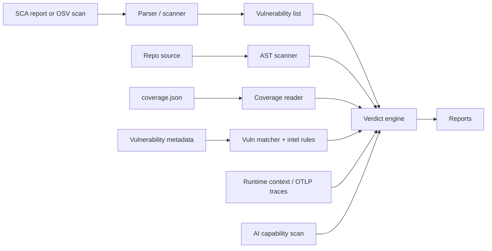

# Architecture Overview

ca9 is designed as a layered pipeline: **ingest -> analyze -> decide -> report**.

## High-level flow



## Module map

```
src/ca9/
├── models.py                 # Dataclasses: Vulnerability, Evidence, Verdict, Report
├── engine.py                 # Verdict engine and evidence orchestration
├── scanner.py                # OSV.dev API client and dependency inventory resolution
├── report.py                 # Table, JSON, and SARIF output
├── vex.py                    # OpenVEX output
├── vex_diff.py               # Continuous VEX diffing
├── remediation.py            # Prioritized remediation plans
├── action_plan.py            # CI/CD action-plan decisions
├── sbom.py                   # CycloneDX/SPDX enrichment
├── threat_intel.py           # EPSS and CISA KEV enrichment
├── runtime_context.py        # Deployment-aware priority adjustment
├── coverage_provider.py      # Coverage discovery and generation helpers
├── cli.py                    # Click CLI entry point
├── analysis/
│   ├── ast_scanner.py        # Static import tracing and dependency discovery
│   ├── api_usage.py          # Vulnerable API usage matching
│   ├── call_graph.py         # Call graph support
│   ├── coverage_reader.py    # coverage.py JSON reader
│   ├── entry_points.py       # Entry point detection
│   ├── exploit_path.py       # Exploit path tracing
│   ├── otel_reader.py        # OTLP JSON trace reader
│   └── vuln_matcher.py       # Affected component extraction
├── capabilities/
│   ├── scanner.py            # AI-BOM and capability scanner
│   ├── diff.py               # Capability diffing
│   ├── policy.py             # Capability policy gates
│   └── detectors/            # MCP, providers, prompts, egress, storage, tools
└── parsers/
    ├── base.py               # SCAParser protocol
    ├── snyk.py               # Snyk JSON parser
    ├── dependabot.py         # Dependabot alerts parser
    ├── trivy.py              # Trivy JSON parser
    └── pip_audit.py          # pip-audit JSON parser
```

The optional MCP server lives in `ca9_mcp/`.

## Design principles

### Small core dependency footprint

The core package depends on `packaging` for PEP 440 version parsing. CLI support is optional through `ca9[cli]`, and MCP support is optional through `ca9[mcp]`.

### Conservative verdicts

ca9 only suppresses a vulnerability when the evidence supports that direction. In `strict` proof mode, weak dynamic suppressions or ambient dependency graph evidence are downgraded to `INCONCLUSIVE`.

### Evidence-first reports

Verdicts carry structured evidence: import state, dependency relationship, affected component source, coverage execution, vulnerable API usage, confidence score, warnings, and optional runtime/threat/capability context.

### Protocol-based parsers

Parsers implement the `SCAParser` protocol. New SCA formats can be added without changing the verdict engine.

## Data flow

1. **Input** - An SCA report, OSV scan inventory, or SBOM.
2. **Normalization** - Parsers convert tool-specific findings into `Vulnerability` objects.
3. **Analysis preparation**:
   - AST scanner collects imports from the repository.
   - Dependency inventory maps declared and transitive packages.
   - Coverage reader loads executed file data if available.
   - Vulnerability matcher extracts affected components.
   - Intel rules identify known vulnerable API targets.
4. **Verdict engine** - Combines evidence and proof policy for each vulnerability.
5. **Enrichment** - Optional threat intel, runtime context, production traces, exploit paths, and capability blast radius.
6. **Output** - Table, JSON, SARIF, OpenVEX, remediation plan, action plan, or enriched SBOM.
