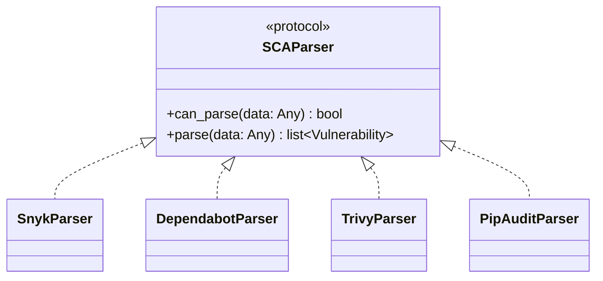

# Parser Architecture

ca9 uses a protocol-based parser system for SCA report ingestion. Each parser converts a vendor-specific JSON shape into ca9's shared `Vulnerability` model.

## Design



The `SCAParser` protocol defines two methods:

- `can_parse(data)` returns `True` when the parser recognizes the input structure.
- `parse(data)` converts raw JSON into a list of `Vulnerability` objects.

## Auto-detection

```python
import json
from pathlib import Path

from ca9.parsers import detect_parser

report_path = Path("report.json")
parser = detect_parser(report_path)
vulnerabilities = parser.parse(json.loads(report_path.read_text()))
```

`detect_parser()` loads the JSON file and tries registered parser classes in order. The first parser whose `can_parse()` method returns `True` is selected.

Current registry:

```python
_PARSERS = [SnykParser, DependabotParser, TrivyParser, PipAuditParser]
```

## Built-in parsers

### Snyk

Detects Snyk reports by checking for a `vulnerabilities` array in a single-project report or an array of project objects containing `vulnerabilities`.

### Dependabot

Detects GitHub Dependabot alert exports by checking for alert objects with `security_advisory` and `dependency` fields.

### Trivy

Detects Trivy JSON reports and extracts vulnerability entries from result sections.

### pip-audit

Detects pip-audit JSON reports and extracts package vulnerability entries.

## Adding a new parser

1. Create `src/ca9/parsers/mytool.py`.
2. Implement `can_parse()` and `parse()`.
3. Register the parser class in `src/ca9/parsers/__init__.py`.

```python
from typing import Any

from ca9.models import Vulnerability


class MyToolParser:
    def can_parse(self, data: Any) -> bool:
        return isinstance(data, dict) and "my_tool_version" in data

    def parse(self, data: Any) -> list[Vulnerability]:
        results = []
        for item in data["findings"]:
            results.append(
                Vulnerability(
                    id=item["id"],
                    package_name=item["package"],
                    package_version=item["version"],
                    severity=item.get("severity", "unknown"),
                    title=item.get("title", ""),
                    description=item.get("description", ""),
                )
            )
        return results
```

Parser order matters because the first matching parser wins.
